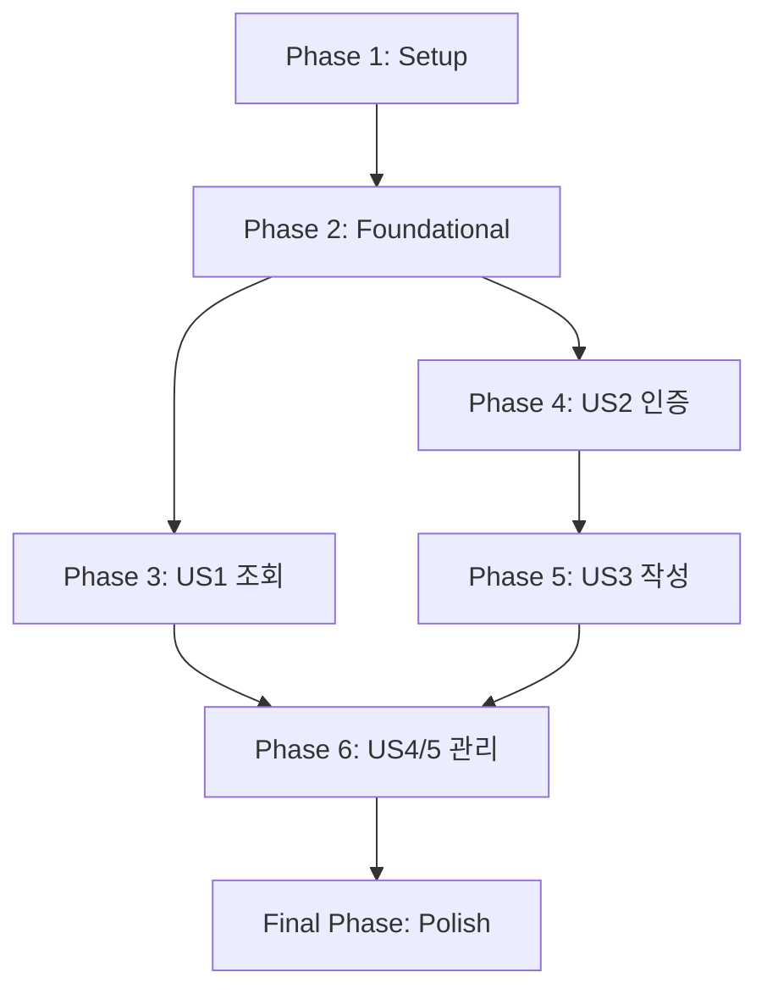

# Task List: 블로그 사이트 제작

**Feature**: `001-react-supabase-gemini`
**Date**: 2025-10-11

이 문서는 블로그 사이트 제작을 위한 구체적인 개발 작업 목록을 정의합니다. 각 작업은 AI 개발 에이전트가 즉시 실행할 수 있도록 명확하게 작성되었습니다.

## Implementation Strategy

MVP(Minimum Viable Product) 우선 접근 방식을 따릅니다. 가장 핵심적인 사용자 스토리(P1)를 먼저 개발하여 최소 기능 버전을 빠르게 출시하고, 이후 P2, P3 순서로 기능을 점진적으로 확장합니다. 각 사용자 스토리는 독립적으로 테스트 및 배포가 가능하도록 작업을 구성합니다.

## Phase 1: Setup (Project Initialization)

프로젝트의 기본 골격을 설정하는 단계입니다.

- **T001**: `frontend` 디렉터리에 `create-react-app`을 사용하여 새로운 React 프로젝트를 생성하고, 불필요한 기본 파일을 정리합니다. [P]
- **T002**: `npm install` 또는 `yarn add`를 사용하여 `supabase-js`와 `react-router-dom` 라이브러리를 설치합니다. [P]
- **T003**: `frontend/src` 디렉터리 내에 `plan.md`에 명시된 MVC 구조(`components`, `controllers`, `models`, `services`, `views`)를 생성합니다.
- **T004**: `frontend/src/services/supabase.js` 파일을 생성하고, `.env` 파일의 환경 변수를 사용하여 Supabase 클라이언트를 초기화하는 코드를 작성합니다.
- **T005**: 전역적으로 적용될 블랙 테마 CSS 파일(`frontend/src/index.css`)을 작성하고, 기본 배경색, 폰트 색상 등을 설정합니다.

## Phase 2: Foundational Tasks (Blocking Prerequisites)

모든 사용자 스토리가 의존하는 핵심 기반을 구축하는 단계입니다.

- **T006**: `frontend/src/components/Navbar.js` 컴포넌트를 생성합니다. 이 컴포넌트는 로고, 로그인/회원가입 버튼, 로그인 시 글쓰기/로그아웃 버튼을 포함합니다.
- **T007**: `frontend/src/App.js` 파일에서 `react-router-dom`을 사용하여 기본 라우팅(메인, 로그인, 회원가입, 글쓰기 등)을 설정하고, 모든 페이지에 `Navbar`가 표시되도록 레이아웃을 구성합니다.

## Phase 3: User Story 1 - 게시글 조회 및 정렬 (P1)

**Goal**: 방문자가 사이트에서 게시글 목록을 보고 정렬할 수 있습니다.
**Independent Test**: 비로그인 상태로 메인 페이지에 접속하여 게시글 목록과 정렬 버튼이 정상 작동하는지 확인합니다.

- **T008**: [US1] `frontend/src/models/postModel.js` 파일에 `getPosts` 함수를 구현합니다. 이 함수는 `services/supabase.js`를 사용하여 Supabase DB에서 게시글 목록을 조회하고, 정렬 옵션(`latest`, `popular`)을 처리합니다. `popular` 정렬 기준은 현재 없으므로, 우선 `created_at` 기준으로만 구현합니다. [P]
- **T009**: [US1] `frontend/src/components/PostList.js` 와 `PostItem.js` 컴포넌트를 생성합니다. `PostList`는 게시글 배열을 받아 `PostItem`으로 렌더링합니다. [P]
- **T010**: [US1] `frontend/src/views/HomePage.js` 뷰(페이지)를 생성합니다. 이 뷰는 `getPosts`를 호출하고, `PostList` 컴포넌트를 사용하여 게시글 목록과 정렬 버튼을 화면에 표시합니다.
- **T011**: [US1] `frontend/src/controllers/homeController.js` 컨트롤러를 생성하여 `HomePage`의 상태(게시글 목록, 정렬 상태)를 관리하고, 정렬 버튼 클릭 이벤트를 처리하는 로직을 구현합니다.

**CHECKPOINT**: 방문자가 메인 페이지에서 게시글 목록을 볼 수 있습니다.

## Phase 4: User Story 2 - 사용자 가입 및 로그인 (P1)

**Goal**: 사용자가 사이트에 가입하고 로그인할 수 있습니다.
**Independent Test**: 상단 네비게이션 바의 버튼을 통해 회원가입 및 로그인을 수행하고, 로그인 상태가 `Navbar`에 반영되는지 확인합니다.

- **T012**: [US2] `frontend/src/models/authModel.js` 파일에 `signUp`, `signIn`, `signOut` 함수를 구현합니다. 각 함수는 `services/supabase.js`를 사용하여 Supabase의 인증 기능을 호출합니다. [P]
- **T013**: [US2] `frontend/src/views/SignUpPage.js` 와 `LoginPage.js` 뷰를 생성합니다. 각 뷰는 이메일/비밀번호 입력을 위한 폼을 포함합니다. [P]
- **T014**: [US2] `frontend/src/controllers/authController.js` 컨트롤러를 생성하여 회원가입/로그인 폼의 상태를 관리하고, `authModel`의 함수를 호출하여 실제 인증을 처리하는 로직을 구현합니다.
- **T015**: [US2] `frontend/src/models/userModel.js` 파일에 현재 로그인된 사용자 정보를 관리하는 로직을 구현합니다. (예: 전역 상태 관리 Context API 또는 Recoil/Zustand 사용)

**CHECKPOINT**: 사용자가 회원가입하고 로그인/로그아웃할 수 있습니다.

## Phase 5: User Story 3 - 게시글 작성 및 이미지 첨부 (P2)

**Goal**: 로그인한 사용자가 새 게시글을 작성하고 이미지를 본문에 첨부할 수 있습니다.
**Independent Test**: 로그인 후 글쓰기 페이지로 이동하여, 제목/내용/탭을 입력하고 이미지 파일을 붙여넣기 한 뒤 발행하여 글이 정상 생성되는지 확인합니다.

- **T016**: [US3] `frontend/src/views/EditorPage.js` 뷰를 생성합니다. 이 뷰는 제목, 탭, 내용 입력을 위한 폼 필드를 포함합니다. (로그인한 사용자만 접근 가능하도록 Private Route 설정 필요)
- **T017**: [US3] `frontend/src/models/postModel.js`에 `createPost` 함수와 `uploadImage` 함수를 구현합니다. `uploadImage`는 Supabase Storage에 이미지를 업로드하고 URL을 반환합니다.
- **T018**: [US3] `frontend/src/controllers/editorController.js` 컨트롤러를 생성합니다. 내용(content) 입력 필드에 `paste` 이벤트를 감지하여, 클립보드의 이미지 파일을 `uploadImage`로 업로드하고 반환된 URL을 Markdown 이미지 태그로 변환하여 텍스트 에어리어에 삽입하는 로직을 구현합니다.
- **T019**: [US3] `editorController.js`에 '발행' 버튼 클릭 시 `createPost`를 호출하여 게시글을 생성하는 로직을 구현합니다.

**CHECKPOINT**: 로그인한 사용자가 새 글을 작성하고 이미지를 첨부할 수 있습니다.

## Phase 6: User Story 4 & 5 - 게시글 수정/삭제 및 관리 (P2, P3)

**Goal**: 사용자가 자신의 글을, 관리자는 모든 글을 수정/삭제할 수 있습니다.
**Independent Test**: 자신의 글과 남의 글에 접속했을 때 수정/삭제 버튼 노출 여부를 확인하고, 기능이 정상 작동하는지 확인합니다.

- **T020**: [US4] `frontend/src/views/PostDetailPage.js` 뷰에 현재 로그인한 사용자가 게시글 작성자인 경우에만 '수정', '삭제' 버튼이 보이도록 UI 로직을 추가합니다.
- **T021**: [US4] `frontend/src/models/postModel.js`에 `updatePost`와 `deletePost` 함수를 구현합니다.
- **T022**: [US4] `EditorPage.js`를 수정 모드에서도 사용할 수 있도록 수정합니다. (기존 게시글 데이터를 불러와 폼을 채우는 기능 추가)
- **T023**: [US5] `PostDetailPage.js` 뷰에 로그인한 사용자의 `role`이 'admin'일 경우, 모든 게시글에 '수정', '삭제' 버튼이 보이도록 UI 로직을 추가합니다.

## Final Phase: Polish & Cross-Cutting Concerns

- **T024**: 모든 페이지의 스타일을 `index.css`의 블랙 테마에 맞게 다듬고, 일관성을 유지합니다.
- **T025**: 사용자 피드백을 위한 로딩 스피너, 에러 메시지 컴포넌트를 추가하고 각 API 호출에 적용합니다.

## Dependencies

## Parallel Execution Examples

- **Phase 1**: `T001` (CRA)과 `T002` (npm install)는 동시에 시작할 수 있습니다.
- **Phase 3 & 4**: `US1` (게시글 조회)과 `US2` (사용자 인증)는 서로 의존성이 없으므로, `Phase 3`과 `Phase 4`의 작업들은 병렬로 진행할 수 있습니다. (예: `T008`과 `T012`는 동시에 작업 가능)
